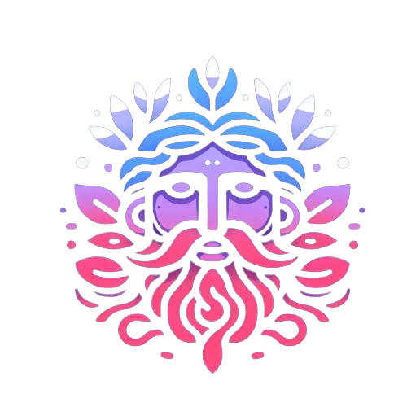

    
    <h1>Morpheus</h1>
    
<i>Alternative frontend for watchsomuch.to</i>

<!-- TOC -->

    
Table of Contents

    <ol>
        <li>
          <a href="#features">Features</a>
        </li>
        <li>
          <a href="#technologies">Technologies</a>
          <ul>
            <li><a href="#language">Language</a></li>
            <li><a href="#framework">Framework</a></li>
            <li><a href="#styling--components">Styling & Components</a></li>
            <li><a href="#hosted-on">Hosted on</a></li>
          </ul>
        </li>
      </ol>

<!-- TOC -->

## About the project

Morpheus is an alternative frontend for watchsomuch.to. You can see the top movies on the homepage, search for movies
and shows, and see downloads for a specific movie or show.

This project is for educational purposes only. I do not condone piracy, and I encourage you to make sure you're not
breaking any laws in your country.

My goal for the project was to create a beautiful frontend for a different website using the Nextjs app router.
I hadn't used the app router before this project, and wanted to try it out. Originally I was going to use Solid Start,
but I had to give up due to numerous complications with the framework. Their docs need to be a lot better before it is
usable for me. (I do know that it's still in beta, and I am excited to see where the project ends up.)

Now I've migrated the project to use TanStack Start. I also hadn't used TanStack Start before, so it
was quite fun to figure out how to do things like server functions in Start.
It's actually been quite easy to migrate to Start and the devEx is amazing. 
Really well done framework.

## Why?

The original website is hideous, and I spontaneously decided to make a better one. I'm not affiliated with the original
website in any way, and I'm not making any money off of this project. It was also a way for me to try out the app router

## Why Morpheus?

Morpheus is the god of dreams in Greek mythology. Gemini and I thought it would be a fitting name for a website that
lets you access movies and shows, which are often a form of escapism.

## Features

- [x] See top movies
- [x] Search for movies and shows
- [x] See downloads for a specific movie or show
- [x] Lovely pastel UI
- [ ] Bugs (hopefully)

## Technologies

The project uses the following technologies:

#### Language:

#### Framework:

  

#### Styling & Components:

  

#### Hosted On:

